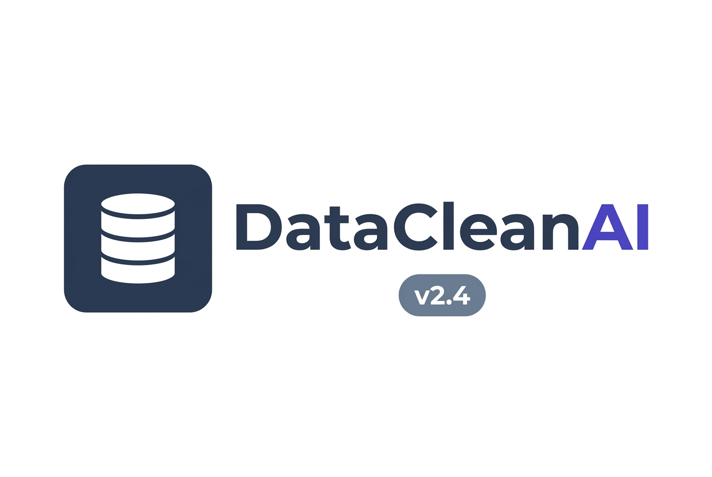

<div align="center">



### AI & Machine Learning-Powered Automated Data Quality Assessment & Cleaning Platform

[](https://fastapi.tiangolo.com/)
[](https://reactjs.org/)
[](https://www.typescriptlang.org/)
[](https://duckdb.org/)
[](https://scikit-learn.org/)
[](https://www.python.org/)
[](https://www.docker.com/)

</div>

---

## 🔍 The Problem

> **80% of time in data science is spent cleaning data — not building models.**

Raw datasets arrive with missing values, duplicate records, type mismatches, outliers, PII exposure risks, and business rule violations. Manual cleaning is slow, error-prone, and leaves no audit trail.

---

## ✅ The Solution — DataCleanAI

DataCleanAI is an **enterprise-grade automated data quality and cleaning engine** that transforms raw, messy tabular datasets into clean, validated, production-ready data in minutes — with a full ML-powered pipeline, visual quality scores, and auditable transformation history.

```
Upload CSV/Excel  →  Profile & 4D Health  →  Validate Custom Rules  →  ML Clean  →  Export
```

---

## ✨ Enterprise Features

| Feature | Description |
|---|---|
| ⚡ **1 GB Upload Support** | Stream-process CSV, Excel (`.xlsx`, `.xls`), JSON datasets up to 1 GB |
| 📊 **4D Health Scoring** | Completeness, Accuracy, Consistency, and Timeliness scoring engine |
| 🤖 **Isolation Forest ML** | Unsupervised ML multi-column outlier and anomaly detection |
| 🎯 **KNN & MICE Imputation** | Predict missing values using feature correlation ML models |
| 🔗 **Fuzzy Deduplication** | RapidFuzz Levenshtein distance near-duplicate entity clustering |
| 🔍 **PII & Semantic Classifier** | Automatic detection of EMAIL, PHONE, SSN, CREDIT_CARD, IP fields |
| 📏 **Custom Rules Builder** | Define custom business constraints (`Age >= 18`, `Salary > 0`, regex, list matching) |
| 🦆 **Dynamic DuckDB SQL Console** | In-memory DuckDB engine with dynamic SQL presets tailored to uploaded dataset structure |
| 📋 **HTML/PDF Audit Reports** | Executive before/after quality comparison dashboards and changelog exports |
| 🧹 **Session Clean Start** | Fresh project initialization on load with automatic cache & history cleanup on new upload |
| 🐳 **Docker Ready** | One-command `docker compose up` stack deployment |

---

## 🚀 Quick Start

### Option 1 — Docker (Recommended) 🐳

```bash
git clone https://github.com/Daksh3468/DataCleanAI.git
cd DataCleanAI

# Start entire stack (Backend API + Frontend SPA)
docker compose up --build
```

| Service | URL |
|---|---|
| 🌐 Frontend SPA | http://localhost:5173 |
| ⚙️ Backend REST API | http://localhost:8000 |
| 📖 Interactive API Docs | http://localhost:8000/docs |

---

### Option 2 — Local Development

**Prerequisites:** Python 3.11+, Node.js 18+, npm

```bash
git clone https://github.com/Daksh3468/DataCleanAI.git
cd DataCleanAI
```

**1. Backend (FastAPI + DuckDB + Scikit-Learn)**
```bash
cd backend
cp ../.env.example ../.env

pip install -r requirements.txt
python run.py
# → http://localhost:8000
```

**2. Frontend (React + TypeScript + Vite)**
```bash
cd frontend
npm install
npm run dev
# → http://localhost:5173
```

---

## 🧪 Verification & Testing

```bash
# Backend — pytest suite
cd backend
pytest

# Frontend — TypeScript type check + Vite production build
cd frontend
npm run build
```

---

## 📁 Sample Test Datasets

Try DataCleanAI instantly with sample datasets located in [`sample_datasets/`](sample_datasets/):

| Dataset | Description | Rows | Primary Test Case |
|---|---|---|---|
| 📄 [`Messy_Employee_dataset.csv`](sample_datasets/Messy_Employee_dataset.csv) | HR & Employee Records | ~1,020 | Salary outliers, missing emails, whitespace trim |
| 📄 [`crime_incidents_messy.csv`](sample_datasets/crime_incidents_messy.csv) | Law Enforcement Logs | ~5,250 | High missingness, weapon type & date normalization |
| 📄 [`online_retail_real_world.csv`](sample_datasets/online_retail_real_world.csv) | E-Commerce Sales | ~3,000 | Price/Quantity anomalies, customer ID nulls |
| 📄 [`gender_submission.csv`](sample_datasets/gender_submission.csv) | Classification Benchmark | ~418 | Uniqueness verification, binary casting |

---

## 📄 Compliance & Legal

- [Privacy Policy](http://localhost:5173/privacy)
- [Terms of Service](http://localhost:5173/terms)

---

<div align="center">
  © 2026 <strong>DataCleanAI Inc.</strong> All rights reserved. • Built by <a href="https://github.com/Daksh3468">Daksh</a>
</div>
