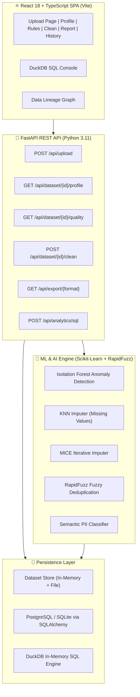

<div align="center">

# 🧬 DataCleanAI

### AI & Machine Learning-Powered Automated Data Quality Assessment & Dataset Cleaning Platform

[](https://fastapi.tiangolo.com/)
[](https://reactjs.org/)
[](https://www.typescriptlang.org/)
[](https://scikit-learn.org/)
[](https://duckdb.org/)
[](https://www.python.org/)
[](https://www.sqlalchemy.org/)
[](https://www.docker.com/)

**[Live Demo](#quick-start) · [API Docs](http://localhost:8000/docs) · [Report Bug](https://github.com/Daksh3468/DataCleanAI/issues)**

</div>

---

## 🔍 The Problem

Every data team deals with the same painful reality:

> **80% of time in data science is spent cleaning data — not building models.**

Raw datasets arrive with missing values, duplicate records, type mismatches, outliers, PII exposure risks, and business rule violations. Manual cleaning is:
- **Slow** — analysts spend hours wrangling CSVs
- **Error-prone** — human mistakes introduce new problems
- **Undocumented** — no audit trail of what changed and why

---

## ✅ The Solution — DataCleanAI

DataCleanAI is an **enterprise-grade automated data quality and cleaning engine** that transforms raw, messy tabular datasets into clean, validated, production-ready data in minutes — with a full ML-powered pipeline, visual quality scores, and auditable transformation history.

```
Upload CSV/Excel  →  Profile & Score  →  Validate Rules  →  ML Clean  →  Export
```

---

## 🏗️ Architecture



---

## ✨ Features

| Feature | Description |
|---|---|
| ⚡ **1 GB Upload Support** | Stream-process CSV, Excel, JSON datasets up to 1 GB |
| 📊 **4D Quality Scoring** | Completeness, Validity, Uniqueness, Consistency scoring engine |
| 🤖 **Isolation Forest** | Unsupervised ML multi-column outlier detection |
| 🎯 **KNN & MICE Imputation** | Predict missing values using feature correlation ML models |
| 🔗 **Fuzzy Deduplication** | RapidFuzz Levenshtein distance near-duplicate entity clustering |
| 🔍 **PII Classifier** | Semantic detection of EMAIL, PHONE, SSN, CREDIT_CARD, IP fields |
| 📏 **Custom Rules Builder** | Define business constraints (`Age >= 18`, `Salary > 0`, regex) |
| 🦆 **DuckDB SQL Console** | Run raw SQL queries in-browser against your dataset |
| 📋 **HTML Audit Reports** | Self-contained before/after quality comparison reports |
| 🗂️ **Data Lineage Graph** | Visual versioning trail from Raw → Cleaned dataset |
| 📁 **Audit History** | PostgreSQL/SQLite persistent transformation changelog |
| 🐳 **Docker Ready** | One-command `docker compose up` deployment |

---

## 🚀 Quick Start

### Option 1 — Docker (Recommended) 🐳

```bash
git clone https://github.com/Daksh3468/DataCleanAI.git
cd DataCleanAI

# Start entire stack (PostgreSQL + Backend + Frontend)
docker compose up --build
```

| Service | URL |
|---|---|
| 🌐 Frontend | http://localhost |
| ⚙️ Backend API | http://localhost:8000 |
| 📖 API Docs (Swagger) | http://localhost:8000/docs |

---

### Option 2 — Local Development

**Prerequisites:** Python 3.11+, Node.js 18+, npm

```bash
git clone https://github.com/Daksh3468/DataCleanAI.git
cd DataCleanAI
```

**1. Backend**
```bash
cd backend

# Copy environment config
cp ../.env.example ../.env
# Add your API keys to .env (optional: GROQ_API_KEY for AI features)

pip install -r requirements.txt
python run.py
# → http://localhost:8000
```

**2. Frontend**
```bash
cd frontend
npm install
npm run dev
# → http://localhost:5173
```

---

## 📸 Workflow

```
┌──────────────────────────────────────────────────────────────────────────┐
│ 1. UPLOAD    →  2. PROFILE   →  3. RULES    →  4. CLEAN    →  5. EXPORT │
│                                                                          │
│ Drop CSV       4D Quality      Custom           ML KNN         CSV        │
│ Excel XLSX     Score Card      Business         MICE           Excel      │
│ JSON           Column Stats    Constraints      Outlier Cap    HTML Report│
│                Missing Map     Regex Rules      Dedup          Audit Log  │
└──────────────────────────────────────────────────────────────────────────┘
```

### Data Lineage Tracking

```
v1.0 Raw Upload  →  v1.1 Deduplicated  →  v1.2 ML Imputed  →  v1.3 Type Fixed  →  v2.0 Golden Dataset
```

---

## ⚡ Performance Benchmarks

| Dataset | Rows | Columns | Profile Time | Memory |
|---|---|---|---|---|
| Titanic Tier | 1,000 | 10 | ~0.05s | 2 MB |
| Retail Tier | 50,000 | 15 | ~0.3s | 45 MB |
| Enterprise Tier | 1,000,000 | 12 | ~4.2s | 890 MB |

*Benchmarks measured on Python 3.11, pandas 2.0, Scikit-Learn 1.3 on a standard developer laptop*

---

## 🗂️ Project Structure

```
DataCleanAI/
│
├── 🐳 docker-compose.yml            # Docker stack orchestration
├── 🐳 Dockerfile.backend            # FastAPI Python container
├── 🐳 Dockerfile.frontend           # Nginx + React SPA container
├── 📄 README.md
├── ⚙️ .env.example                   # Environment configuration template
│
├── backend/                         # FastAPI REST API (Python 3.11)
│   ├── app/
│   │   ├── api/                     # REST Route Handlers
│   │   │   ├── upload.py            # Dataset ingestion endpoint
│   │   │   ├── profile.py           # Data profiling endpoints
│   │   │   ├── quality.py           # 4D quality scoring
│   │   │   ├── rules.py             # Custom validation rules
│   │   │   ├── clean.py             # ML cleaning pipeline
│   │   │   ├── export.py            # CSV/Excel/HTML export
│   │   │   ├── analytics.py         # DuckDB SQL & Correlation
│   │   │   ├── ai.py                # ML AI engine endpoints
│   │   │   └── history.py           # Audit log history
│   │   ├── core/
│   │   │   ├── config.py            # App settings & env vars
│   │   │   └── logging_config.py    # Structured rotating logger
│   │   ├── database/
│   │   │   ├── models.py            # SQLAlchemy ORM models
│   │   │   └── connection.py        # DB engine & session factory
│   │   ├── services/                # Business logic domain services
│   │   │   ├── profiling/           # Dataset profiling & benchmarks
│   │   │   ├── cleaning/            # Transformation pipeline
│   │   │   ├── validation/          # File & rule validators
│   │   │   ├── reporting/           # HTML report generation
│   │   │   ├── storage/             # Dataset store & persistence
│   │   │   ├── ml_ai/               # Isolation Forest, KNN, RapidFuzz, PII
│   │   │   └── analytics/           # DuckDB SQL engine & correlations
│   │   └── schemas/                 # Pydantic request/response models
│   ├── tests/                       # pytest automated test suites
│   ├── logs/                        # Rotating structured log files
│   ├── requirements.txt
│   └── run.py                       # Uvicorn server launcher
│
└── frontend/                        # React 18 + TypeScript SPA (Vite)
    └── src/
        ├── components/              # Reusable UI components
        │   ├── Navbar.tsx
        │   ├── Footer.tsx
        │   ├── DataGrid.tsx         # Virtualized data table
        │   ├── QualityGauge.tsx     # Score gauge charts
        │   ├── KPICard.tsx          # Metric cards
        │   ├── SQLConsole.tsx       # DuckDB SQL editor
        │   ├── DataLineage.tsx      # Data versioning graph
        │   └── RuleBuilderModal.tsx
        ├── pages/                   # Route pages
        │   ├── UploadPage.tsx
        │   ├── ProfilePage.tsx
        │   ├── RulesPage.tsx
        │   ├── CleanPage.tsx
        │   ├── ReportPage.tsx
        │   └── HistoryPage.tsx
        ├── services/api.ts          # Axios API client
        └── types/index.ts           # TypeScript interfaces
```

---

## 🧪 Testing

```bash
# Backend — pytest suite (AI engine, export, upload pipeline)
cd backend
pytest

# Frontend — TypeScript type check + Vite production build
cd frontend
npm run build
```

**Current test coverage:** 8/8 backend integration tests passing ✅

---

## 🔭 Future Work

| Feature | Priority |
|---|---|
| 🤖 Groq LLM Natural Language Query Interface | ⭐⭐⭐⭐⭐ |
| 📈 Polars integration for large-scale (10M+ row) performance | ⭐⭐⭐⭐⭐ |
| 📬 Scheduled dataset monitoring (cron-based re-profiling) | ⭐⭐⭐⭐ |
| 🔐 Role-based access control (Admin / Analyst / Viewer) | ⭐⭐⭐⭐ |
| 📡 Webhook alerts on quality score degradation | ⭐⭐⭐⭐ |
| ☁️ Cloud export (S3, GCS, Azure Blob) | ⭐⭐⭐ |
| 🔌 dbt integration for pipeline orchestration | ⭐⭐⭐ |

---

## 🤝 Contributing

Pull requests are welcome. For major changes, please open an issue first to discuss what you would like to change.

---

<div align="center">
  <strong>Built by <a href="https://github.com/Daksh3468">Daksh</a></strong>
</div>
